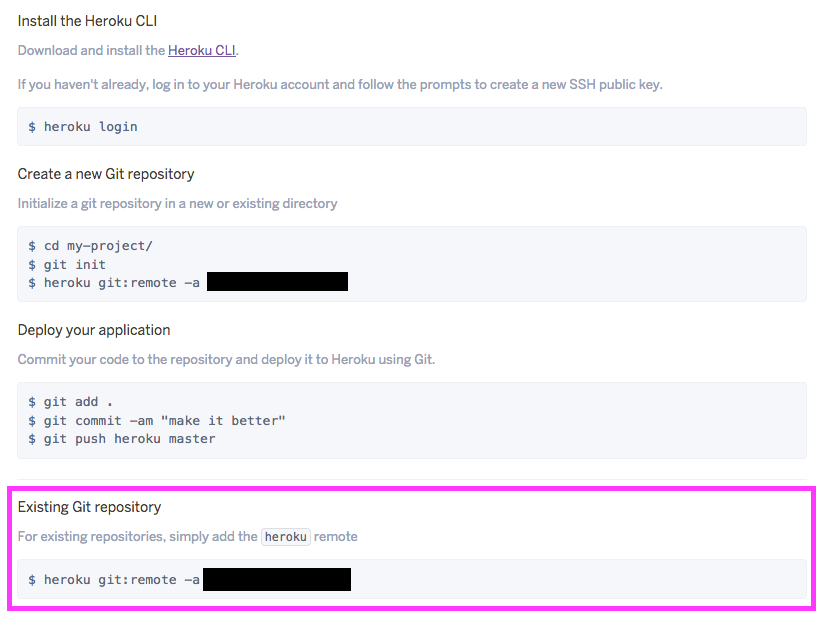

# [node.js]ExpressプロジェクトをHerokuにデプロイするまで

プライベートでバックエンドは今までPHPを触っていたんですけど、仕事でマークアップメインでやる上にJavaScriptもPHPもやるってなるとどれも浅い知識で終わってしまう気がしてきたので、バックエンドでもJavaScriptを触るためにnode.jsに移行することに。

ただ、今プライベートでしようしているレンタルサーバーではnode.jsが使えないので、Herokuを使用することに。node.jsのフレームワークであるExpressプロジェクトをHerokuにデプロイするまでの手順をメモとして。


## 端末で一度しておけばいい作業

### express,express-generatorのインストール

```
npm install -g express
npm install -g express-generator
```

### Heroku CLIのインストール

```
brew install heroku

heroku login
```


## プロジェクト毎にする作業

### expressプロジェクトの作成

```
mkdir project-name

cd project-name

express .
```

### git関係作業

まず事前にgit initからの最初のコミットまで済ませていること前提。

Herokuにログインして、対象のAPPのDeployタブ、「Deploy using Heroku Git」の項目「Existing Git repository」に記載の方法でremoteリポジトリを登録する。



それでpushすればOK

```
heroku git:remote -a [リポジトリ名]

git push heroku master
```

push後何か色々設定とかする必要があるかなとか思ったけど、heroku側がいい感じにやってくれてるみたいで特に必要なし。

何かあればまた追記する。
