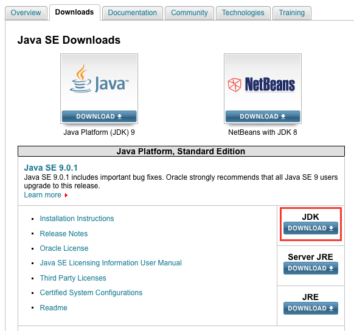

# atomでPlantUMLを使用する方法


## graphvizのインストール

```
brew install graphviz
```


## JDKのダウンロード

[Java SE - Downloads | Oracle Technology Network | Oracle](http://www.oracle.com/technetwork/java/javase/downloads/index.html)

下記画像赤枠部分のボタンからダウンロード。




## atomに`plantuml-viewer`をインストール

インストールすればいい。


## 試す

以下のようなコードを入力した上で、`Ctrl+Option+P`でビューワー起動

```
class ClassA {
  init()
}

class ClassB {
  init()
}

ClassA -> ClassB
```
