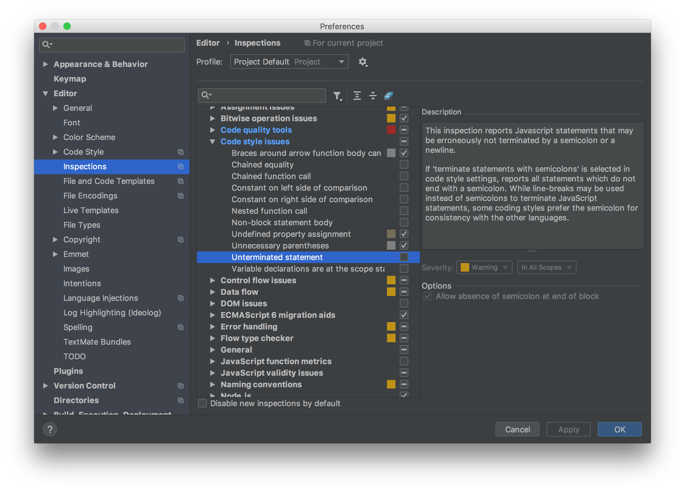

# [PHPStorm]ESLintで保存時にAutoFix

## 手順

### 端末ごとに１回だけやればいい

+ `ESLintの自動修正+保存`のマクロを登録

### プロジェクト毎にやる

+ PHPStormでESLintを利用するようにする
+ エイリアスを利用している場合は、PHPStormにエイリアスを認識させるためのファイルを配置


## 詳細

### `ESLintの自動修正+保存`のマクロを登録

キーマップの設定から`Fix ESLint Problems`に対して適当なショートカットを設定。設定したショートカットはマクロ経由でしか使わないので本当に適当でいい。

`Edit > Macros > Start Macro Recording`で、`Fix ESLint Problems(先程設定したショートカット) > Command+S`を実行。`Edit > Macros > Stop Macro Recording`をし適当な名前でマクロを保存。

最後に、キーマップの設定から`Command+S`に作成したマクロを登録することで保存と同時にESLintのFixが実行されるようになる。

### PHPStormでESLintを利用するようにする

`Preferences > Languages & Frameworks > JavaScript > Code Quality Tools > ESLint`でESLintの設定を開き、`Enable`にチェックを入れる

### エイリアスを利用している場合は、PHPStormにエイリアスを認識させるためのファイルを配置

`import SomeClass from '@/SomeClass'`といった感じで`@`をエイリアスとして使用することが多いが、プロジェクト内の`webpack.config.js`にエイリアスの指定がされていない場合はPHPStormが認識してくれない。例えば`Vue CLI`や`Laravel Mix`を使用しているときとか。

なので、以下のような内容のファイルをプロジェクトに配置して、`@`をエイリアスとして認識させる。（`Laravel Mix`での例）

```
// PHPStormにaliasを認識させるためのファイル
System.config({
  paths: {
    '@/*': 'resources/assets/js/*',
  },
})
```

`Vue CLI`の場合だと`Preference > Languages & Frameworks > Webpack > webpack configuration file`から`/Users/xxxx/project/node_modules/@vue/cli-service/webpack.config.js`といった感じで`Vue CLI`のconfigを読むようにして解決する方法もある。（`Laravel Mix`だと無理）


## トラブルシューティング

### スタンダードスタイルなのに、「セミコロンがないよ」って警告が出る

PHPStormデフォ機能のコードスタイルチェックが、何故かESLintがあるのに勝手に働いてしまう時がある。

`Preference > Editor > Inspections > JavaScript > Code Style Issues`から`Unterminated Statement`のチェックを外せば警告が出なくなる。



同様の方法でVueテンプレート内にでる大量のHTMLの警告も消せる。
