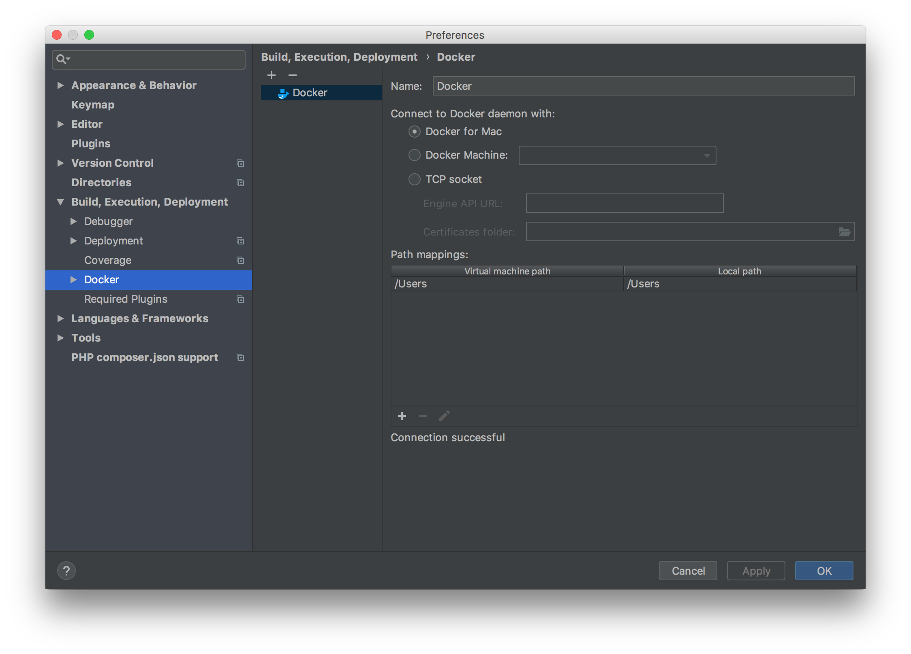
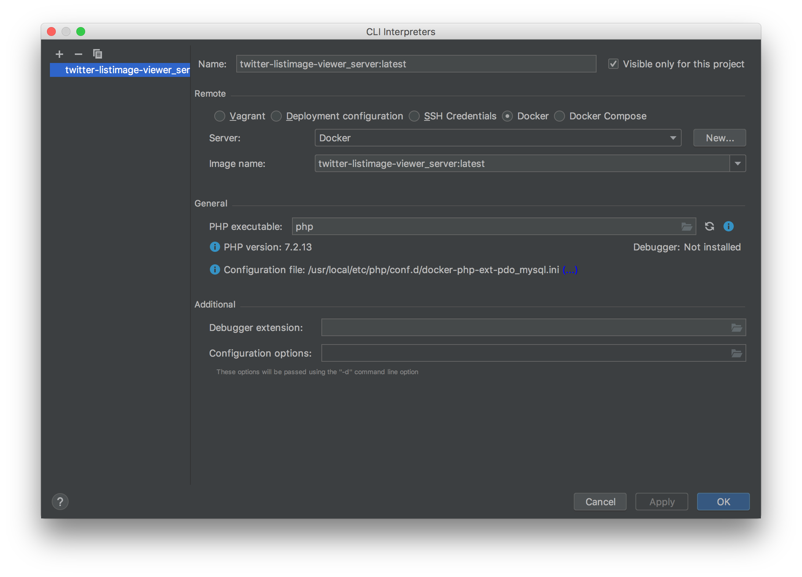
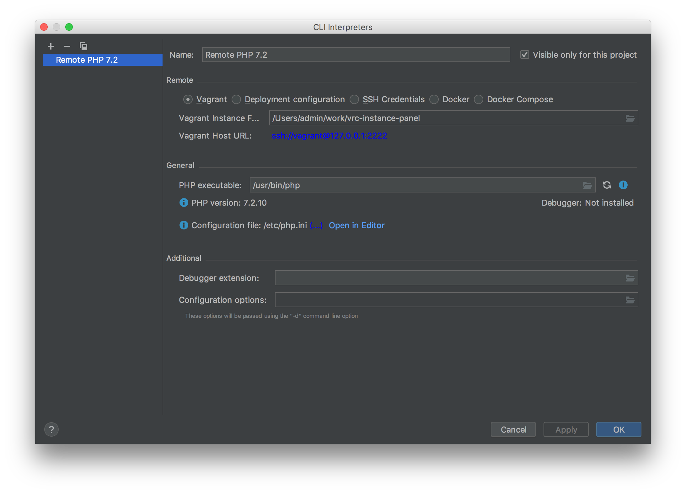
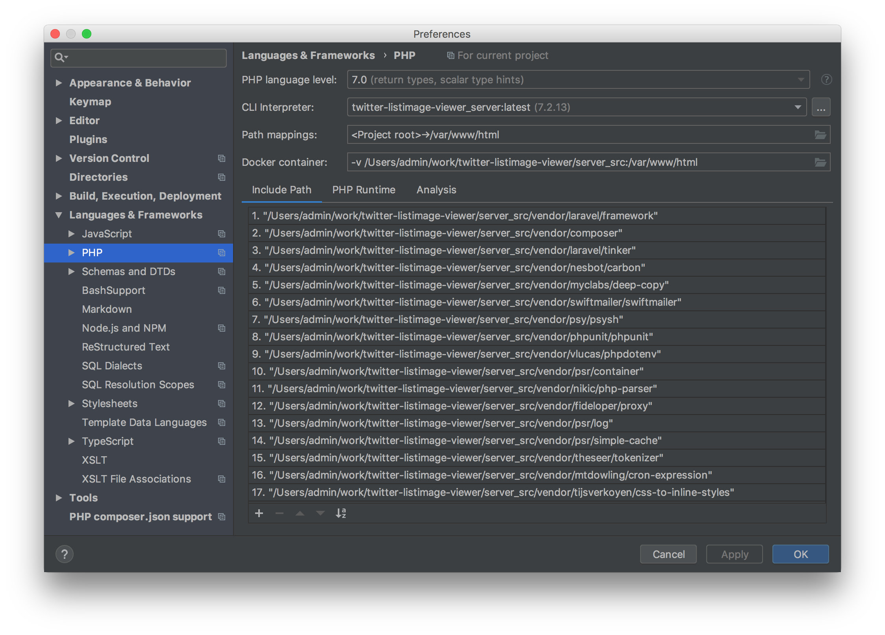
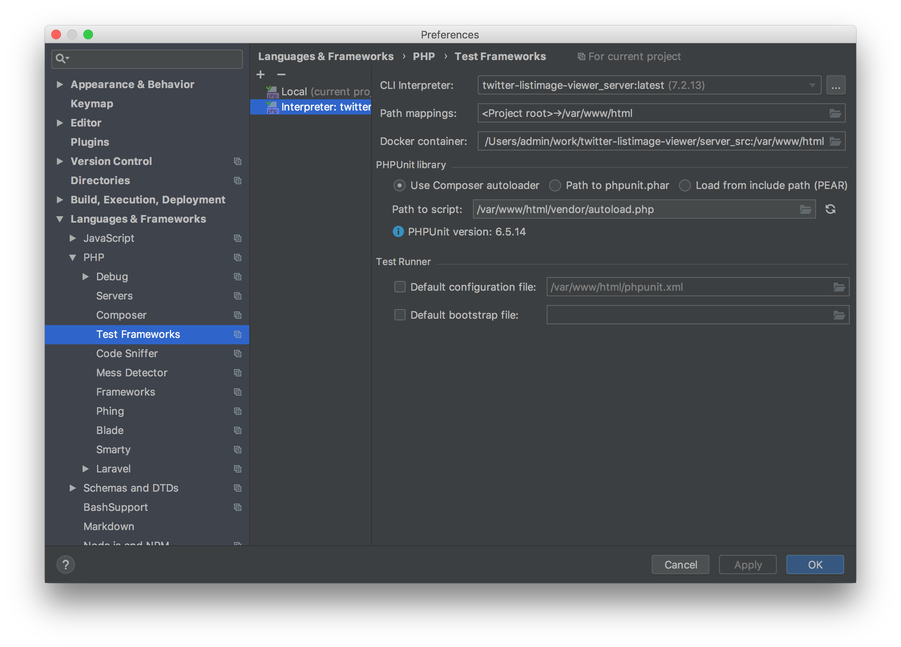
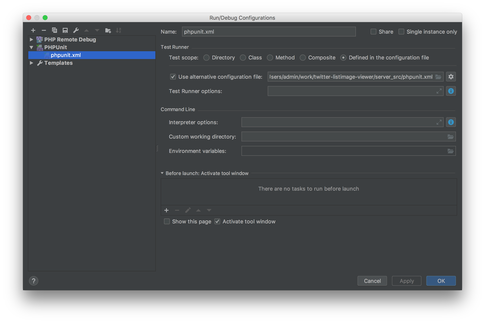

# [PHPStorm]LaravelのPHPUnitを実行

## 手順

+ （Dockerの場合）Dockerの設定
+ CLI Interpreterの設定
+ PHPUnitの設定
+ テスト実行に関する設定

## 詳細

### （Dockerの場合）Dockerの設定

`Preference > Build, Execution, Development > Docker`で`+`を押して以下の内容を設定。（Docker for Mac以外の設定方法は知らん）

### CLI Interpreterの設定

PHPUnit実行に使うPHPの設定。

`Preference > Languages & Frameworks > PHP`から、`CLI Interpreter`の右にある`...`をクリックした以下画面を表示。

`+`を押して追加した後、`Remote`の項目にDockerならDocker、VagrantならVagrantを指定して必要な項目を設定。

設定後、OKを押して前の画面に戻るとなんか諸々設定されている。

ここで注意として、Dockerの場合`Path mapping`をきちんと設定しなおさないといけない。Vagrantだと多分Vagrantfileを見ていい感じに設定してくれるけど、Dockerの場合は流石にそこまでカバーしきれないっぽい。

### PHPUnitの設定

`Preference > Languages & Frameworks > PHP > Test Frameworks`でPHPUnitの設定をする。

`+`を押して、`PHPUnit by Remote Interpreter`を押下。先程設定したInterpreterを選択してOK。

（なんか最初から一つ設定があるけど、それはローカルのPHPとかを使用してやるやつっぽい。Docker/Vagrantを使用している場合は当然仮想環境内でPHPを実行するので、それは使わない。）

### テスト実行に関する設定

最後にテスト実行に関する設定をする

`Run > Edit Configurations`で`+`を押して`PHPUnit`を選択。

後は以下のの画像のように`Use alternative configuration file`をONにして、`phpunit.xml`を設定する。

そうすれば右上の虫っぽいボタン押してテスト実行したり、テストファイルのメソッドの左に出てくる矢印アイコン押して個別にテスト実行したり出来る。

## 参考

[PhpStormからLaradockのテストを実行する - Qiita](https://qiita.com/rytskywlkr/items/052b2802689f156c263d)
