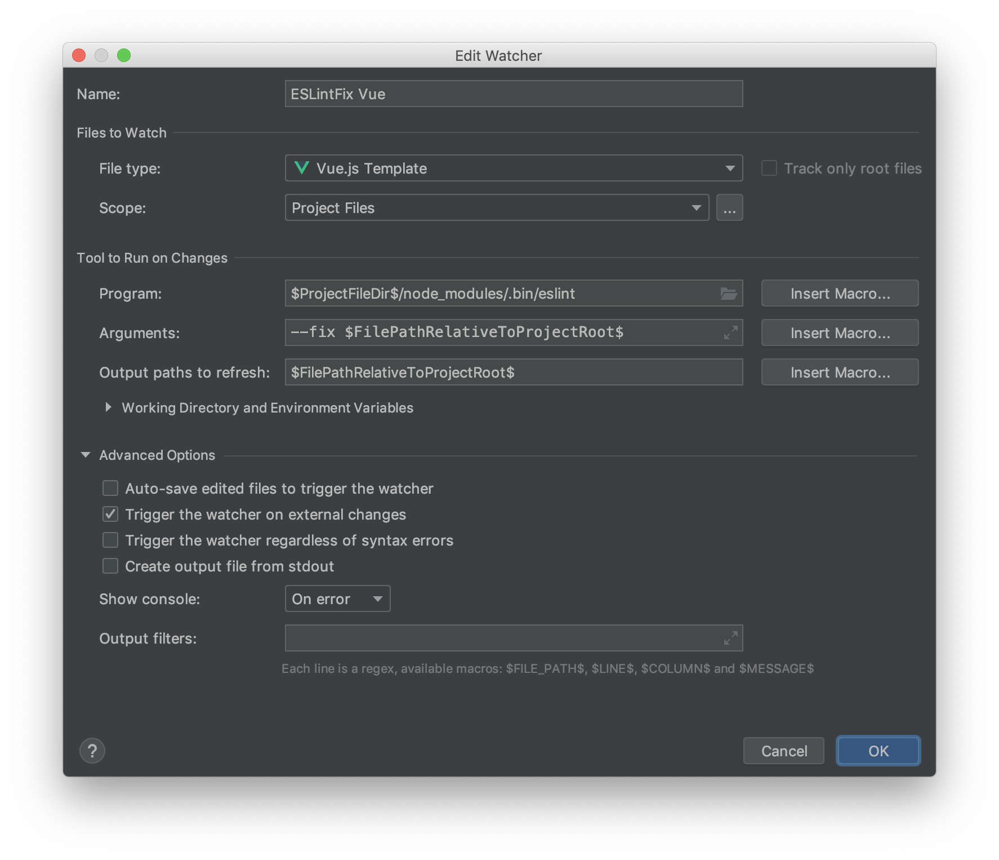

# WebStormでVueプロジェクトの保存時フォーマット

保存から0.5~1秒程度要してしまうが、ファイル保存時に特定のコマンドを実行させる`FileWatcher`の機能を使えば実現可能。（Mac/WebStorm環境で確認）

## やること

+ VueCLIでフォーマッタにPrettierを指定した場合の出力ファイルを参考に環境の準備
+ WebStormのFileWatcherを設定する

## VueCLIでフォーマッタにPrettierを指定した場合の出力ファイルを参考に環境の準備

VueCLIでPrettierをONにした場合の`.eslintrc.js`は以下の通り

```
module.exports = {
  root: true,
  env: {
    node: true
  },
  extends: ["plugin:vue/essential", "@vue/prettier"],
  rules: {
    "no-console": process.env.NODE_ENV === "production" ? "error" : "off",
    "no-debugger": process.env.NODE_ENV === "production" ? "error" : "off"
  },
  parserOptions: {
    parser: "babel-eslint"
  }
};
```

これを元に拡張していけばいい。

例えば、

+ Vueのlintはrecommend設定
  + コンポーネントのプロパティの並びを自動的に整形してくれたりするようになる
+ セミコロン無し
+ 文字列はシングルクォート
+ ケツカンマあり

のようにしたい場合は

```
module.exports = {
  root: true,
  env: {
    node: true
  },
  extends: [
    // ここをrecommendedに変更
    "plugin:vue/recommended",
    "@vue/prettier"
  ],
  rules: {
    "no-console": process.env.NODE_ENV === "production" ? "error" : "off",
    "no-debugger": process.env.NODE_ENV === "production" ? "error" : "off",

    // ここを追加
    "prettier/prettier": [
      "error",
      {
        "singleQuote": true,
        "trailingComma": "es5",
        "semi": false
      }
    ]
  },
  parserOptions: {
    parser: "babel-eslint"
  }
};
```

といった感じにする。

なお、`package.json`は以下の通りだった。

```
{
  "name": "3",
  "version": "0.1.0",
  "private": true,
  "scripts": {
    "serve": "vue-cli-service serve",
    "build": "vue-cli-service build",
    "lint": "vue-cli-service lint",
    "test:e2e": "vue-cli-service test:e2e",
    "test:unit": "vue-cli-service test:unit"
  },
  "dependencies": {
    "core-js": "^2.6.5",
    "vue": "^2.6.10",
    "vue-router": "^3.0.3",
    "vuex": "^3.0.1"
  },
  "devDependencies": {
    "@vue/cli-plugin-babel": "^3.7.0",
    "@vue/cli-plugin-e2e-cypress": "^3.7.0",
    "@vue/cli-plugin-eslint": "^3.7.0",
    "@vue/cli-plugin-unit-jest": "^3.7.0",
    "@vue/cli-service": "^3.7.0",
    "@vue/eslint-config-prettier": "^4.0.1",
    "@vue/test-utils": "1.0.0-beta.29",
    "babel-core": "7.0.0-bridge.0",
    "babel-eslint": "^10.0.1",
    "babel-jest": "^23.6.0",
    "eslint": "^5.16.0",
    "eslint-plugin-vue": "^5.0.0",
    "lint-staged": "^8.1.5",
    "node-sass": "^4.9.0",
    "sass-loader": "^7.1.0",
    "vue-template-compiler": "^2.5.21"
  },
  "gitHooks": {
    "pre-commit": "lint-staged"
  },
  "lint-staged": {
    "*.{js,vue}": [
      "vue-cli-service lint",
      "git add"
    ]
  }
}
```


## WebStormのFileWatcherを設定する

`Preferences > Tools > FileWatcher`から`+`ボタンを押して以下のような設定を追加する。



この設定はファイルタイプ毎に用意する必要があるので、上記画像の設定に加えてJSファイル用の設定も追加する必要がある。（`File type`の項目をJavaScriptに変えて追加すればいいだけ）
